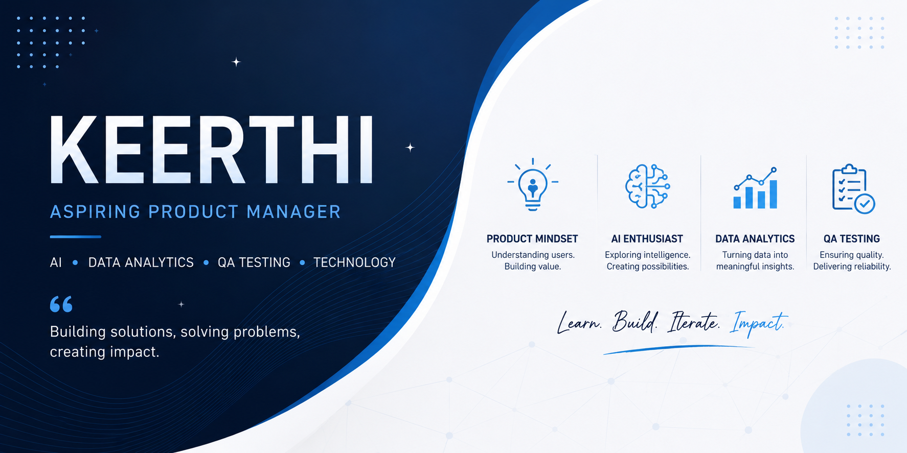

  

<h1 align="center">Hi 👋, I'm Keerthi</h1>

<h3 align="center">
Aspiring Product Manager | AI & Data Analytics Enthusiast | QA Testing Learner
</h3>

Passionate about building impactful products, understanding user needs,
and leveraging technology to solve real-world problems.

  📍 India • 🎓 Engineering Student • 🚀 Lifelong Learner

---

## 👩‍💻 About Me

- 🎓 Engineering Student
- 💡 Interested in Product Management, AI, Data Analytics & QA Testing
- 📊 Exploring data-driven decision making and user-centric product design
- 🚀 Building projects and continuously improving my skills
- 🌱 Currently learning SQL, Product Management, AI and Analytics
- 🤝 Open to collaboration on innovative projects

---

## 🛠️ Skills & Technologies

### Currently Learning

- Product Management
- Artificial Intelligence
- Data Analytics
- SQL
- QA Testing
- Web Development

---

## 🎯 Current Goals

- Build a strong Product Management foundation
- Strengthen SQL and Data Analytics skills
- Develop impactful AI projects
- Improve QA Testing knowledge
- Create a professional project portfolio
- Prepare for placements and industry opportunities

---

## 🏆 What I'm Focusing On

- Product Thinking
- Problem Solving
- User Experience
- Data-Driven Decision Making
- Quality Assurance
- Continuous Learning

---

## 🌐 Connect With Me

📧 Email: bhuvanakeerthimaringanti@gmail.com

---

## 📈 Profile Visitors

  

---

  <i>Learning. Building. Iterating. Growing.</i>

